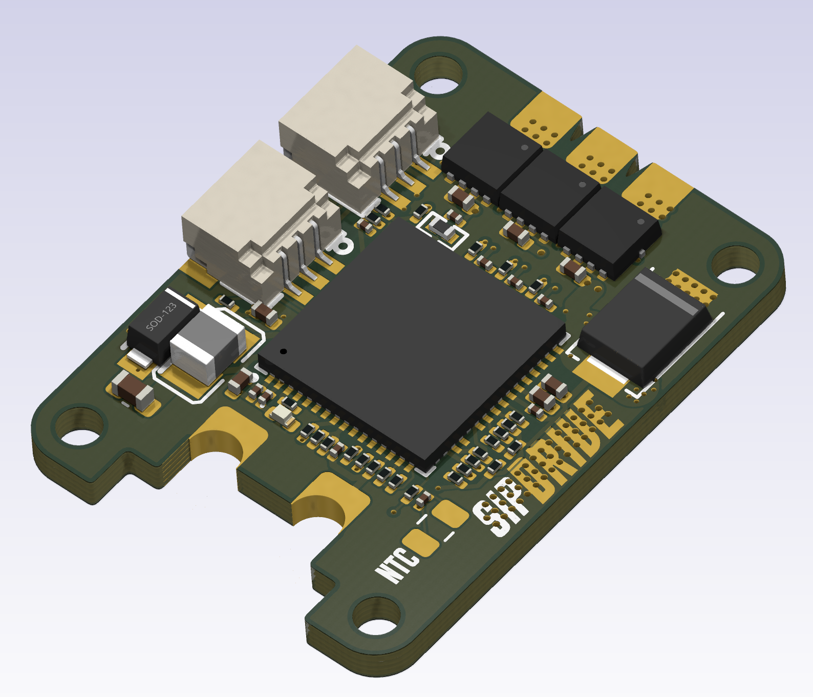
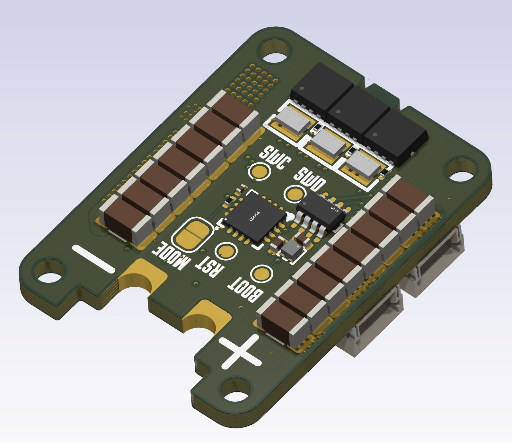

# SiPDrive (Work In Progress, Status: Ordering first hardware)

**Compact Field-Oriented Control (FOC) firmware and hardware for QDD actuators**

SiPDrive is an open-source motor controller built around the STSPIN32G4 System-in-Package, MT6701 magnetic encoder, and CAN-FD communication. It targets compact quasi-direct-drive (QDD) actuator applications with torque, position, and speed control.

<p align="center">
  
  
</p>

| | Status |
|---|---|
| **Build** | Compiles (macOS ARM GCC 15.2.0) |
| **Hardware** | PCB designed, ordering assembled from JLCPCB |
| **Firmware** | ~3,100 LOC, 11 KB Flash (8.4%), 13 KB RAM (59%) |
| **License** | CC BY-NC 4.0 |

### Key Features

- 40 kHz FOC current loop with hardware CORDIC acceleration
- CAN-FD command/telemetry (1 Mbps nominal, 5 Mbps data)
- Current and position control modes
- 14-bit magnetic encoder (MT6701 SSI/ABZ selectable via solder jumper)
- On-device encoder calibration with 128-entry compensation table
- Persistent configuration in flash (CRC32 protected)
- Thermal derating and fault protection (board + stator NTC)
- Space Vector PWM (SVPWM) with configurable duty limits

---

## Quick Start

### Prerequisites

```bash
# macOS
brew install arm-none-eabi-gcc cmake
```

### Fetch Dependencies

```bash
cd external
git clone --depth 1 --branch 5.9.0 https://github.com/ARM-software/CMSIS_5.git CMSIS
git clone --depth 1 https://github.com/STMicroelectronics/cmsis_device_g4.git
```

### Build

```bash
cmake -B build \
  -DCMAKE_TOOLCHAIN_FILE=cmake/arm-none-eabi-gcc.cmake \
  -DCMAKE_BUILD_TYPE=Release \
  -DSIPDRIVE_CMSIS_CORE_DIR=external/CMSIS/CMSIS/Core/Include \
  -DSIPDRIVE_STM32G4_DEVICE_DIR=external/cmsis_device_g4

cmake --build build
```

Outputs: `build/SiPDrive.elf`, `.bin`, `.hex`, `.map`

### Flash

```bash
# ST-LINK (recommended)
st-flash write build/SiPDrive.bin 0x08000000

# OpenOCD
openocd -f interface/stlink.cfg -f target/stm32g4x.cfg \
  -c "program build/SiPDrive.elf verify reset exit"
```

---

## Repository Layout

```
SiPDrive/
├── src/                    Firmware source (~3,100 LOC)
├── hw/SiPDrive/            KiCad schematic, PCB, datasheets
├── cmake/                  Toolchain configuration
├── link/                   Linker script (STM32G431)
└── external/               CMSIS dependencies (not vendored)
```

---

<details>
<summary><h2>Hardware Architecture</h2></summary>

### Core Components

**STSPIN32G4 (U1)** - System-in-Package containing:
- STM32G431CBU6 (Cortex-M4F @ 170 MHz)
- Integrated 3-phase gate driver
- Buck converter for MCU power
- 3x operational amplifiers for current sensing
- Memory: 128 KB Flash, 22 KB SRAM + 10 KB CCM RAM

**MT6701 (U2)** - 14-bit magnetic angle sensor
- SSI (default, MODE=HIGH) or ABZ mode (JP1 solder jumper to GND)
- PB7=DO/A, PB6=CLK/B, PB4=CSN/Z

**TCAN1057A (U3)** - CAN-FD transceiver (up to 5 Mbps)

### Pin Assignments

| Peripheral | Function | Pins |
|---|---|---|
| TIM1 | 3-phase PWM (internal to STSPIN32G4 gate driver) | GHS/GLS via 20R gate resistors |
| TIM4 | QEI encoder (ABZ mode) or SPI (SSI mode) | PB7=DO/A, PB6=CLK/B, PB4=CSN/Z |
| OPAMP1 | Phase U current (Ia) | PA1(+), PA3(-), PA2(out) |
| OPAMP2 | Phase W current (Ic) | PA7(+), PC5(-), PA6(out) |
| OPAMP3 | Phase V current (Ib) | PB0(+), PB2(-), PB1(out) |
| ADC1/2 | Vbus, board NTC, stator NTC | PC0 (IN6), PC1 (IN7), PC2 (IN8) |
| FDCAN1 | CAN-FD | PA11=RX, PA12=TX, PA10=TCAN standby |
| I2C3 | STSPIN32G4 gate driver config | Internal SiP bus (no external pins) |
| CORDIC | Hardware sin/cos | - |

### Current Sensing

3-shunt topology with biased differential OPAMPs (EVL reference design):
- **Shunts**: 3x 2 mR (SME08A1FR002T, 0805 1W) on low-side MOSFET sources
- **OPAMP gain**: 10x (Rf=15k / Rin=1.5k), mid-rail bias via 30k/30k divider on OPAMP+ nodes
- **MOSFETs**: 6x CMSA015N06 with 20R gate resistors

### Hardware Constraints

- **128 KB Flash** total - code size must be minimized
- **SCREF overcurrent**: 0.30V threshold via 100k/10k divider (~150A trip with 2 mR shunts)
- **MT6701 MODE**: R6 10k pullup = SSI default, JP1 jumper to GND for ABZ mode
- **Stator NTC (R14)**: DNP solder pad for external thermistor

### KiCad Project

- Schematic: `hw/SiPDrive/SiPDrive.kicad_sch`
- PCB: `hw/SiPDrive/SiPDrive.kicad_pcb`
- Netlist: `hw/SiPDrive/SiPDrive.net`
- Custom libraries: `hw/SiPDrive/kicad/libs/`
- Production outputs: `hw/SiPDrive/production/`

</details>

<details>
<summary><h2>Firmware Architecture</h2></summary>

### Source Layout

| File | Purpose |
|---|---|
| `main.cc` | Main loop, CAN protocol, control loop ISR |
| `config.h` | Compile-time constants |
| `foc_core.{h,cc}` | Clarke/Park transforms, PI current control |
| `position_control.{h,cc}` | Position/velocity PID |
| `calibration.{h,cc}` | Encoder calibration state machine |
| `hal_tim1_pwm.{h,cc}` | TIM1 PWM + 40 kHz ISR |
| `hal_adc_opamp.{h,cc}` | ADC + OPAMP (injected + regular) |
| `hal_qei.{h,cc}` | Quadrature encoder (TIM3/4) |
| `hal_fdcan.{h,cc}` | CAN-FD driver |
| `hal_i2c3_stspin.{h,cc}` | Gate driver I2C config |
| `hal_flash.{h,cc}` | Flash read/write |
| `hal_gpio.{h,cc}` | GPIO utilities |
| `thermal.{h,cc}` | NTC monitoring + derating |
| `persistent_config.{h,cc}` | Flash config (CRC protected) |
| `runtime_support.cc` | Math/string fallbacks (no newlib) |

### Startup Sequence

1. Enable DWT cycle counter
2. Load persistent config from flash (or defaults)
3. Init STSPIN32G4 gate driver via I2C3
4. Init TIM1 PWM (40 kHz) + register ISR
5. Init ADC + OPAMP, calibrate current offsets (1024 samples)
6. Init QEI encoder interface
7. Init FDCAN
8. Apply config (PID gains, thermal limits, calibration)
9. Enable TIM1 and power stage
10. Enter main loop

### Main Loop (~1 kHz)

- Service regular ADC (Vbus, NTC temperatures)
- Update thermal protection
- Handle CAN-FD RX (command frames)
- Run calibration state machine (if active)
- Send telemetry (10 Hz heartbeat)
- Sleep via `__WFI()`

### Control Loop ISR (40 kHz)

1. Check fault conditions (hardware, thermal)
2. Sample encoder position/velocity
3. Read injected ADC (Ia, Ib)
4. Compute Id/Iq command (current mode: direct, position mode: PID cascade)
5. Apply thermal derating
6. FOC pipeline: Clarke -> Park (CORDIC) -> PI controllers -> inverse Park -> SVPWM
7. Update TIM1 duty cycles
8. Queue telemetry if heartbeat due

### HAL Abstraction

All hardware access is through `hal_*` modules. When modifying HAL code, ensure ISR timing is preserved. Use `SIPDRIVE_DEBUG_TIMING=ON` to profile via GPIO.

</details>

<details>
<summary><h2>FOC Algorithm</h2></summary>

Implementation in `foc_core.cc`:

**Clarke Transform** (3-shunt, using Ia and Ib; Ic available for validation):
```
i_alpha = ia
i_beta  = (ia + 2*ib) / sqrt(3)
```

**Park Transform** (using CORDIC hardware, Q1.31 format):
```
id =  cos(theta)*i_alpha + sin(theta)*i_beta
iq = -sin(theta)*i_alpha + cos(theta)*i_beta
```

**PI Current Controllers** (independent Id/Iq):
- Default Kp = 0.30, Ki = 200.0
- Anti-windup: integrator clamped to +/-Vbus/2

**SVPWM**: Common-mode voltage centering, duty range 2%-98%

</details>

<details>
<summary><h2>Control Modes</h2></summary>

### Current Mode (`Mode::kCurrent`)
- Direct Id/Iq control
- 4-byte CAN frame: `[Id_mA, Iq_mA]` (int16 LE)

### Position Mode (`Mode::kPosition`)
- Cascaded PID: position -> velocity -> Iq
- Gains scaled by kp_scale, kd_scale (0.0-1.0)
- 16-byte CAN-FD frame (see protocol section)

</details>

<details>
<summary><h2>CAN-FD Protocol</h2></summary>

### Command Frame (default ID: 0x101)

**4-byte legacy** (current control):

| Byte | Field | Type |
|---|---|---|
| 0-1 | Id | int16 mA, LE |
| 2-3 | Iq | int16 mA, LE |
| 4 | Flags | bit0=clear fault, bit1=start cal |

**16-byte extended** (position/current):

| Byte | Field | Type |
|---|---|---|
| 0-3 | Position | float32 rad, LE (NaN = no position loop) |
| 4-7 | Velocity | float32 rad/s, LE |
| 8-9 | Max torque | int16 mA, LE |
| 10-11 | kp_scale | uint16, 0-32767 maps to 0.0-1.0 |
| 12-13 | kd_scale | uint16, 0-32767 maps to 0.0-1.0 |
| 14 | Flags | same as legacy |
| 15 | Mode | 0=current, 1=position |

### Telemetry Frame (default ID: 0x181, 24 bytes, 10 Hz)

| Byte | Field | Type |
|---|---|---|
| 0-3 | Position | float32 rad, LE |
| 4-7 | Velocity | float32 rad/s, LE |
| 8-9 | Iq measured | int16 mA, LE |
| 10-11 | Id measured | int16 mA, LE |
| 12-13 | Vbus | uint16 mV, LE |
| 14-15 | Board temp | int16, 0.01 C, LE |
| 16-17 | Stator temp | int16, 0.01 C, LE |
| 18 | Fault flags | bit0=gate, bit1=CAN, bit2=thermal |
| 19 | Mode | current mode enum |
| 20-23 | Reserved | - |

</details>

<details>
<summary><h2>Configuration</h2></summary>

### Persistent Configuration

Stored in flash (last page), CRC32 protected, magic `0x4D4D4347`.

Fields: motor pole pairs, current limit, PID gains (position Kp/Ki/Kd, velocity Kp/Ki), velocity limit, thermal thresholds, CAN IDs, encoder calibration (offset + 128-entry table).

### Compile-Time Configuration (`config.h`)

| Parameter | Default | Description |
|---|---|---|
| `SIPDRIVE_SYS_CLOCK_HZ` | 170 MHz | PLL or 16 MHz HSI |
| `SIPDRIVE_CONTROL_LOOP_HZ` | 40000 | Control loop rate |
| `SIPDRIVE_PWM_FREQUENCY_HZ` | 40000 | PWM frequency |
| `SIPDRIVE_TIM1_DEADTIME_NS` | 250 | Gate driver deadtime |
| `SIPDRIVE_ENCODER_CPR` | 16384 | MT6701 14-bit |

### CMake Options

| Option | Default | Description |
|---|---|---|
| `SIPDRIVE_USE_PLL170` | ON | 170 MHz PLL clock |
| `SIPDRIVE_USE_BKIN` | OFF | TIM1 break input (PE15) |
| `SIPDRIVE_DEBUG_TIMING` | OFF | GPIO ISR profiling |

### Adding a New Parameter

1. Add CMake cache variable in `CMakeLists.txt`
2. Add `target_compile_definitions` pass-through
3. Add `#ifndef` fallback + `constexpr` in `config.h`

</details>

<details>
<summary><h2>Encoder Calibration</h2></summary>

Implemented in `calibration.cc`. Compensates encoder non-linearity and determines electrical angle offset.

1. **Forward sweep**: Drive motor with fixed d-axis voltage, sweep electrical angle 0 to 2pi, record encoder error
2. **Reverse sweep**: Repeat in opposite direction to average out cogging torque
3. **Compute table**: 128-entry lookup (encoder angle to correction)
4. **Save to flash**: Electrical offset + compensation table persisted

Trigger calibration via CAN command flag bit 1. Motor must be free to rotate.

</details>

<details>
<summary><h2>Thermal Protection</h2></summary>

Two-level protection per sensor (board NTC, stator NTC):

1. **Warning**: Linear current derating from (fault_temp - margin) to fault_temp
2. **Fault**: Power stage disabled above fault threshold

Defaults: board 120 C fault / 25 C margin, stator 150 C fault / 25 C margin.

NTC thermistors read via ADC at ~1 kHz with piecewise lookup-table interpolation.

</details>

<details>
<summary><h2>Build System Details</h2></summary>

### Toolchain

- ARM GCC 15.2.0 (`arm-none-eabi-gcc`)
- CMake >= 3.20
- Cortex-M4F hard-float configuration

### Dependencies

| Dependency | Location | Source |
|---|---|---|
| CMSIS Core 5.9.0 | `external/CMSIS/` | github.com/ARM-software/CMSIS_5 |
| STM32G4 Device | `external/cmsis_device_g4/` | github.com/STMicroelectronics/cmsis_device_g4 |

### Custom Runtime (`runtime_support.cc`)

Provides `sinf`, `cosf`, `sqrtf`, `fmodf`, `atan2f`, `fabsf`, `memset`, `memcpy`, `memmove`, `memcmp`. Needed because Homebrew ARM toolchain lacks newlib. Uses Taylor series approximations - accuracy ~0.001 for trig functions.

### Memory Layout (linker script: `link/stm32g431vb.ld`)

| Region | Address | Size |
|---|---|---|
| FLASH | 0x08000000 | 128 KB |
| RAM | 0x20000000 | 22 KB |
| CCMRAM | 0x10000000 | 10 KB |

### Current Memory Usage

```
FLASH    11,056 B / 128 KB   8.44%
RAM      13,344 B /  22 KB  59.23%
CCM RAM   8,192 B /  10 KB  80.00%
```

Stack is 4 KB, not yet profiled on hardware.

### Verification

```bash
arm-none-eabi-size -A build/SiPDrive.elf
arm-none-eabi-nm -C -S --size-sort build/SiPDrive.elf
```

### Known Build Issues

1. **FDCAN RXESC/TXESC** registers missing from STM32G431 CMSIS headers (lines commented out in `hal_fdcan.cc`)
2. **Math approximations** - Taylor series trig may need improvement for production
3. **No unit tests** - FOC math validated by inspection only

### Datasheets

Component datasheets are in `hw/SiPDrive/datasheets/`. The STM32G4 reference manual (RM0440, ~37 MB) is gitignored to keep clone size down. Download it directly from [ST](https://www.st.com/resource/en/reference_manual/rm0440-stm32g4-series-advanced-armbased-32bit-mcus-stmicroelectronics.pdf) and place at:
```
hw/SiPDrive/datasheets/rm0440-stm32g4-series-advanced-armbased-32bit-mcus-stmicroelectronics.pdf
```

</details>

<details>
<summary><h2>Bring-Up Workflow</h2></summary>

### Pre-Flight Checklist

- [ ] Motor pole pairs match `config.h` (`kMotorPolePairs = 7`)
- [ ] Encoder CPR correct (`kEncoderCountsPerRev = 16384`)
- [ ] Shunt value correct (`kShuntOhm = 0.002`)
- [ ] OPAMP gain matches hardware (`kOpampGain = 10.0`)
- [ ] Current limits set appropriately
- [ ] Bus voltage safe (`kBusVoltageV = 24.0f`)
- [ ] Thermal limits reviewed

### Step-by-Step

1. **Bench setup**: Current-limited supply, motor free, ST-LINK connected, CAN-FD adapter with 120 ohm termination

2. **Flash**: `st-flash write build/SiPDrive.bin 0x08000000`

3. **CAN-FD host setup**:
   ```bash
   sudo ip link set can0 down
   sudo ip link set can0 type can bitrate 1000000 dbitrate 5000000 fd on
   sudo ip link set can0 up
   ```

4. **Verify telemetry**: `candump can0,181:7FF`

5. **Low-current test** (Id=0, Iq=1000 mA):
   ```bash
   cansend can0 101##10000E803
   ```

6. **Position mode**: Only after current control is validated. Start with small torque limits and low gains.

7. **Calibration**: Set command flag bit 1 in CAN frame.

8. **Validate**: PWM outputs, current polarity, encoder direction, thermal/fault behavior.

### Safety Warnings

- Code is **untested** - expect bugs
- Current sensing polarity is **unknown** until verified
- Electrical angle offset requires **calibration**
- No hardware current limit - **software only**
- Stack usage is **unprofiled**

</details>

<details>
<summary><h2>Schematic Audit (2026-02-14)</h2></summary>

Validated against STSPIN32G4, EVLSPIN32G4-ACT, MT6701, and TCAN1057A datasheets.

**Verdict**: Schematic is ready for PCB layout.

### Current Sensing (validated)

3-shunt biased differential topology matching EVLSPIN32G4-ACT reference:
- 30k/30k bias dividers on OPAMP+ nodes (PA1, PA7, PB0) - provides 1.65V mid-rail DC bias
- 1.5k input resistors from shunt nodes to OPAMP+ inputs
- 15k/1.5k feedback gives 10x differential gain
- 2 mR shunts (SME08A1FR002T, 0805 1W) — full-scale ±82.5A, ~40 mA/LSB resolution

### SCREF Divider (valid)

R15=100k / R37=10k / C30=33n gives VSCREF = 0.300 V. Within STSPIN32G4 valid range (0.2 V to 2.55 V). Estimated trip current ~120 A for 2.5 mohm RDS(on).

### 6S Battery Divider (valid)

R10=100k / R9=10k gives gain 11. At 25.2 V max: Vadc = 2.29 V (within 3.3 V range).

### Inter-IC Validation

| Connection | Status |
|---|---|
| U1 PB7 <-> U2 A (encoder) | Pass |
| U1 PB6 <-> U2 B (encoder) | Pass |
| U1 PB4 <-> U2 Z (encoder) | Pass |
| U2 MODE (strap R6 + JP1) | Pass |
| U1 PA12 -> U3 TXD (CAN) | Pass |
| U1 PA11 <- U3 RXD (CAN) | Pass |
| U1 PA10 -> U3 S (CAN mode) | Pass |

### Remaining Items

1. Clean KiCad ERC warnings (PWR_FLAG hygiene, unused pin markers)
2. Consider adding dedicated VREF+ filtering (ferrite + cap) for improved ADC accuracy in production

</details>

<details>
<summary><h2>Comparison to moteus</h2></summary>

SiPDrive is inspired by [mjbots moteus](https://github.com/mjbots/moteus) but optimized for compactness:

| Feature | moteus | SiPDrive |
|---|---|---|
| MCU | STM32G474 (512K Flash, 128K RAM) | STM32G431 (128K Flash, 32K RAM) |
| Gate Driver | DRV8323 (external) | STSPIN32G4 (integrated SiP) |
| Current Sensing | 3-phase | 3-phase (3x 2 mR shunts, 10x OPAMP) |
| Build System | Bazel + mbed-os | CMake + bare-metal |
| Control Rate | 30 kHz | 40 kHz |
| Communication | CAN-FD + RS485 | CAN-FD only |
| Encoder | AS5047P (SPI) | MT6701 (SSI/ABZ, jumper selectable) |
| Form Factor | Standalone PCB | Compact (motor-mounted) |
| Maturity | Production | Alpha (untested) |
| Binary Size | ~100 KB+ | 11 KB |

### Functional Gaps vs moteus `fw`

SiPDrive is intentionally minimal (~3.7k LOC vs ~21.7k LOC). Key differences:

**Control**: Only current + position modes. Missing: voltage modes, trajectory shaping, torque model, feedforward.

**Protocol**: Fixed CAN frames. Missing: register-based protocol, multiplex server, dynamic config.

**Sensing**: MT6701 SSI/ABZ via jumper. Missing: multi-source position pipeline, AUX port support.

**Safety**: Basic fault flags + thermal. Missing: structured fault codes, timing violation detection, command timeout.

**Testing**: No unit tests or simulation. Missing: host-side protocol tests, regression suite, bootloader.

</details>

<details>
<summary><h2>Roadmap</h2></summary>

### P0: Bring-Up and Controllability
- CAN-FD payload sizing hardening (RXESC/TXESC)
- Host control tooling (Python `python-can` script)
- Safety minimums: UV/OV faults, watchdog (IWDG), fault latching
- Lock MT6701 MODE strategy, validate encoder paths
- Commissioning flow: flash -> telemetry -> low-current spin -> calibration

### P1: Control Quality
- Motor characterization (R, L, electrical direction)
- Loop-rate separation (velocity/position at lower rate)
- Telemetry expansion (electrical angle, duty, loop errors)

### P2: Production-Ready
- Control deadline monitoring
- DMA for regular ADC
- Field weakening, MTPA, optional sensorless estimator

### Future
- CAN bootloader for field updates
- Register-based protocol (moteus compatibility)
- Advanced calibration (multi-turn, temp compensation)
- Host-side unit tests for FOC math and protocol
- Stack profiling and memory optimization

### Known Limitations

- Firmware currently uses only 2 of 3 OPAMP channels (3rd available for validation)
- No hardware overcurrent protection
- PWM frequency not runtime-configurable
- No FOC decoupling (back-EMF, cross-coupling feedforward)
- Taylor series math may be insufficient for high-performance FOC

</details>

<details>
<summary><h2>Debugging and Troubleshooting</h2></summary>

### No Current Sensing
- Check OPAMP config in `hal_adc_opamp.cc`
- Verify ADC injected channels match OPAMP outputs
- Scope OPAMP outputs (should be 0-3.3 V)

### Motor Not Spinning
- Scope TIM1 PWM outputs
- Verify gate driver enabled (`hal_i2c3_stspin.cc`)
- Check fault flags in telemetry
- Verify encoder reads valid position

### Encoder Calibration Fails
- Motor must be free to rotate
- Check ABZ signal connections
- Verify QEI config (`hal_qei.cc`)

### CAN Issues
- Check transceiver wiring and bus termination (120 ohm)
- Verify bitrate: nominal 1 Mbps, data 5 Mbps, FD+BRS
- Debug with `candump can0`

### Debug Tools
- `SIPDRIVE_DEBUG_TIMING=ON`: GPIO toggle on PC14 for ISR profiling
- SWD via ST-LINK + GDB: `arm-none-eabi-gdb build/SiPDrive.elf`
- CAN sniffing: `candump can0`

</details>

<details>
<summary><h2>Code Style</h2></summary>

- **C++17** (configured in CMakeLists.txt)
- Classes: `PascalCase`
- Functions: `PascalCase`
- Variables: `snake_case`
- Constants: `kPascalCase`
- Members: `snake_case_` (trailing underscore)
- Namespaces: `sipdrive::module`
- Headers: `#pragma once`
- ISR code should be inlined; use `__attribute__((hot))` for critical paths

</details>

<details>
<summary><h2>Common Tasks</h2></summary>

### Modifying FOC Gains

Compile-time in `config.h`:
```cpp
constexpr float kIdKp = 0.30f;
constexpr float kIdKi = 200.0f;
constexpr float kIqKp = 0.30f;
constexpr float kIqKi = 200.0f;
```

### Adding a New CAN Command

1. Add handler in `main.cc` `HandleCommandFrame()`
2. Parse frame data with byte helpers (`ReadFloatLe`, etc.)
3. Update global state
4. Document protocol

### Adding a New Fault

1. Add fault flag bit in telemetry definition
2. Implement detection in main loop or ISR
3. Set fault variable (`volatile bool`)
4. In `ControlLoopIsr()`, check and disable power stage
5. Add clear mechanism via CAN command flag

</details>

---

## References

- [STSPIN32G4 Datasheet](hw/SiPDrive/datasheets/stspin32g4.pdf)
- [MT6701 Datasheet](hw/SiPDrive/datasheets/MT6701.pdf)
- [TCAN1057A-Q1 Datasheet](hw/SiPDrive/datasheets/tcan1057a-q1.pdf)
- [STM32G431 Datasheet](hw/SiPDrive/datasheets/stm32g431c6.pdf)
- STM32G4 Reference Manual (RM0440) - [download from ST](https://www.st.com/resource/en/reference_manual/rm0440-stm32g4-series-advanced-armbased-32bit-mcus-stmicroelectronics.pdf) (gitignored, 37 MB)
- FOC Theory: "Vector Control of AC Machines" (Peter Vas)
- SVPWM: ST Application Note AN4013

## License

This project is licensed under [CC BY-NC 4.0](https://creativecommons.org/licenses/by-nc/4.0/) - free for all non-commercial use. See [LICENSE](LICENSE) for details.
